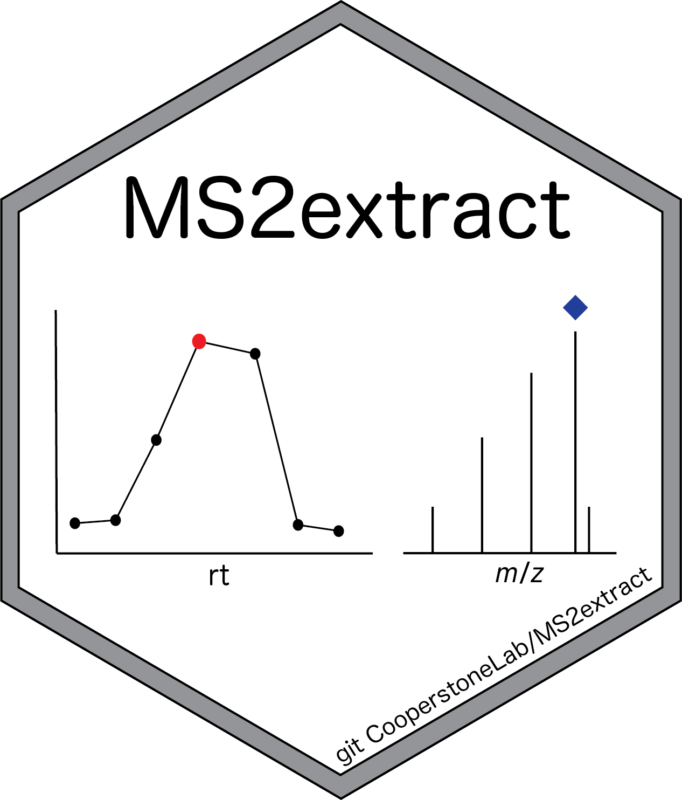

<!-- README.md is generated from README.Rmd. Please edit that file -->



# MS2extract

<!-- badges: start -->

[](https://github.com/CooperstoneLab/MS2extract/actions/workflows/test-coverage.yaml)
[](https://bioconductor.org/checkResults/release/bioc-LATEST/MS2extract)
[](https://bioconductor.org/checkResults/devel/bioc-LATEST/MS2extract)
[](http://bioconductor.org/packages/stats/bioc/MS2extract/)
[](https://support.bioconductor.org/tag/MS2extract)
[](https://bioconductor.org/packages/release/bioc/html/MS2extract.html#since)
[](http://bioconductor.org/checkResults/devel/bioc-LATEST/MS2extract/)
[](https://bioconductor.org/packages/release/bioc/html/MS2extract.html#since)
<!-- badges: end -->

[MS2extract website](https://cooperstonelab.github.io/MS2extract/)

The goal of MS2extract is to provide a tool to import MS2 data of known
standards or material and targeted extract the MS2 spectra in order to
create an in-house MS2 library.

> This package aids the creation and automatization of in-house
> libraries

> This package DO NOT support algorithms to annotate MS/MS data

## Installation

You can install the development version of MS2extract from
[GitHub](https://github.com/) with:

``` r
# install.packages("devtools")
devtools::install_github("CooperstoneLab/MS2extract")
```

## Example

### PPM calculation

with ppm_range you can compute a the ppm error given a m/z value and a
ppm tolerance.

``` r
library(MS2extract)
#> Warning in fun(libname, pkgname): mzR has been built against a different Rcpp version (1.0.10)
#> than is installed on your system (1.0.11). This might lead to errors
#> when loading mzR. If you encounter such issues, please send a report,
#> including the output of sessionInfo() to the Bioc support forum at 
#> https://support.bioconductor.org/. For details see also
#> https://github.com/sneumann/mzR/wiki/mzR-Rcpp-compiler-linker-issue.
## calculating ppm range
chlorogenic_acid_pos <- 355.1023
ppm_error <- 10
# Calculate ranges
ppm_range(mz = chlorogenic_acid_pos, ppm = ppm_error)
#> [1] 355.0987 355.1059
```

### Importing mzxml files

You can import mzxml files with the `import_mzxml()` function. This will
import MS2 scans into a data frame. In this case, we are going to work
with the Procyanidin A2 spectra in negative mode, with a collision
energy of 20 eV.

``` r
# File path
ProcA2_file <- system.file("extdata",
  "ProcyanidinA2_neg_20eV.mzXML",
  package = "MS2extract"
)
# Compound data
ProcA2_data <- data.frame(Formula = "C30H24O12", Ionization_mode = "Negative")

ProcA2_raw <- import_mzxml(ProcA2_file, ProcA2_data)
#> Reading MS2 data from ProcyanidinA2_neg_20eV.mzXML
#> Processing...
```

### Extracting Procyanidin A2 spectra

Here, the mzxml file contains only the scans in the retention time
window of Procyanidin A2. With the `extract_MS2()` functions users can
detect and extract the most intense MS2 scans, and displays the TIC
indicating which scan is the most intense

``` r
ProcA2_ext <- extract_MS2(ProcA2_raw, verbose = TRUE, out_list = FALSE)
```


This function returns a list, which contains the MS2 spectra, and the
MS2 TIC plot. Since the extracted MS2 spectra contains low intensity
signals (i.e. background noise), you can remove them by using the
`detect_mass()` function.

The raw MS2 spectra contains 6226 signals which the majority of them are
low intensity signals (background noise).

``` r
dim(ProcA2_ext)
#> [1] 6226    4
```

### Detecting masses

The objective is to remove low intensity signals, you can detec masses
by allowing normalization by the base peak and then filtering the
signals by a minimum treshold, or detecting mass with the abolute signal
intensity.

Here, we will detect masses by normalization and with a minimum
intensity of 1%

``` r
ProcA2_detected <- detect_mass(ProcA2_ext,
  normalize = TRUE, # Allow normalization
  min_int = 1
) # 1% as minimum intensity

dim(ProcA2_detected)
#> [1] 38  4
```

Now we can see that the x-axis in the MS2 spectra is reduced to 575 m/z
since the low intensity signals were removed.

``` r
plot_MS2spectra(ProcA2_detected)
```


Although the resulting MS2 spectra contains 38 signals, for displaying
purposes we are going to include signlas greater than 10% intensity

``` r
dplyr::filter(ProcA2_detected, intensity > 10)
#>         mz intensity mz_precursor      rt
#> 1 285.0406        62     575.1196 170.667
#> 2 289.0718        48     575.1196 170.667
#> 3 407.0769        16     575.1196 170.667
#> 4 423.0723        53     575.1196 170.667
#> 5 449.0880        51     575.1196 170.667
#> 6 452.0745        15     575.1196 170.667
#> 7 539.0983        22     575.1196 170.667
#> 8 575.1197       100     575.1196 170.667
#> 9 576.1221        13     575.1196 170.667
```

### Comparing two MS2 spectra with cosine score

The purpose of this section is to compare two MS2 spectra that were
extracted using this package and using PCDL, a compound library
developed by Agilent.

Thus, we include the MS2 spectra extracted with PCDL and use cosine
similarity score to compare them by the `compare_spectra()` function.

``` r
# MS2 PCDL spectra
ProcA2_pcdl_fl <- system.file("extdata",
  "ProcA2_neg_20eV_PCDL.csv",
  package = "MS2extract"
)
# Reading the spectra
ProcA2_PCDL <- read.csv(ProcA2_pcdl_fl)

# Comparing both spectra
compare_spectra(ProcA2_detected, ProcA2_PCDL)
```


    #> $similarity.score
    #> [1] 0.9953542
    #> 
    #> $alignment
    #>          mz intensity.top intensity.bottom
    #> 1  125.0242            10               10
    #> 2  285.0405            62               59
    #> 3  289.0716            48               45
    #> 4  407.0767            16               17
    #> 5  423.0720            53               53
    #> 6  449.0876            51               50
    #> 7  452.0742            15               20
    #> 8  539.0978            22               22
    #> 9  575.1195           100              100
    #> 10 576.1221            13                0
    #> 
    #> $plot
    #> gTree[GRID.gTree.168]
