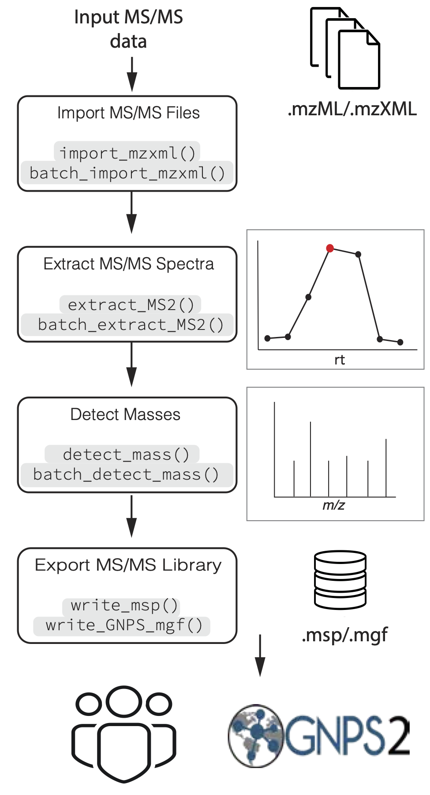

```{r, include = FALSE}
knitr::opts_chunk$set(
  collapse = TRUE,
  comment = "#>"
)
```


# Introduction

In the previous tutorial 
[Introduction to MS2extract package](https://cooperstonelab.github.io/MS2extract/articles/introduction.html),
we described in a detailed manner the core functions of the package. If you are starting
to use the MS2extract package with this tutorial, we encourage you to take 
a look at this tutorial first.

Once you are familiar with the core workflow and functions of this
package, we can dive into an automated pipeline with the proposed
`batch_*()` functions. If you find that you want to extract many MS/MS spectra 
at once, you will want to use these `batch_*()` functions

The first three main steps have a separate `batch_*()` alternative functions;
importing mzXML files, extracting MS/MS spectra,
and detecting masses. However, exporting your library to a `.msp` or `.mgf`
file is able to detect if the provided spectra come from a 
single or multiple `.mzXML`/`.mzML` files,
so the same function works in both cases.

```{r Fig 1, echo=FALSE, fig.cap= "Figure 1. Overview of general data processing pipeline to extract MS/MS spectra using the MS2extract package", out.width= "80%", out.height="80%", message=FALSE, warning=FALSE, paged.print=FALSE, fig.align='center'}

```

## Batch functions

We are familiar with the arguments that the core functions accept. In this
section, we describe extra arguments that specific `batch_*()` functions require.

### batch_import_mzxml


```{r setup, include=FALSE, eval=TRUE}
knitr::opts_chunk$set(warning = FALSE)
library(MS2extract)
```

Similarly to `import_mzxml()`, we need to provide the compound metadata, describing
the compound name, formula, ionization mode, and collision energy. 
Optionally, but recommended, the region of interest where each compound
elutes (*min_rt* and *max_rt*).


```{r}
# Select the csv file name and path
batch_file <- system.file("extdata", "batch_read.csv",
  package = "MS2extract"
)
# Read the data frame
batch_data <- read.csv(batch_file)

# File paths for Procyanidin A2 and Rutin
ProcA2_file <- system.file("extdata",
  "ProcyanidinA2_neg_20eV.mzXML",
  package = "MS2extract"
)
Rutin_file <- system.file("extdata",
  "Rutin_neg_20eV.mzXML",
  package = "MS2extract"
)

# Add file path - User should specify the file path -
batch_data$File <- c(ProcA2_file, Rutin_file)

# Checking batch_data data frame
dplyr::glimpse(batch_data)
```

The only difference between `batch_import_mzxml()` and  `import_mzxml()` 
is that  `met_metadata` can be more than one row. In this example, 
we are working with two compounds, procyanidin A2 and rutin.


> **Tip:** You can extract multiple compounds from the same .mzXML if they have different precursor ion *m*/*z*.

> **Tip:** You can also specify multiple compounds with the same m/z as long as they have different retention times.

```{r}
batch_compounds <- batch_import_mzxml(batch_data)
```

The raw mzXML data contains:

* Procyanidin A2: 24249 ions
* Rutin: 22096 ions

```{r}
# Checking dimensions by compound
purrr::map(batch_compounds, dim)
```

### batch_extract_MS2()

Now that we have our data imported, we can proceed to extract the most
intense MS/MS scan for each compound. In this case, the `batch_extract_MS2()`
functions do not have extra arguments, although most arguments remian
fairly similar.


```{r}
# Use extract batch extract_MS2
batch_extracted <- batch_extract_MS2(batch_compounds,
  verbose = TRUE,
  out_list = FALSE
)
```

By using `verbose = TRUE`, we can display the MS/MS TIC plot as well the raw
MS/MS spectra of the most intense scan for each compound.

### batch_detect_mass()

Now that we have the raw MS/MS spectra, we will remove background 
noise based on intensity. `batch_detect_mass()` has the same arguments
as its core analog.


```{r}
batch_mass_detected <- batch_detect_mass(batch_extracted, # Compound list
  normalize = TRUE, # Normalize 
  min_int = 1  # 1% minimum intensity
)

purrr::map(batch_mass_detected, dim)
```


We see a decrease in the number of ions, 38 and 4 ions for procyanidin A2 and rutin,
respectively.


#### Detected MS2 Procyanidin A2

```{r message=FALSE, warning=FALSE}
plot_MS2spectra(batch_mass_detected, "Procyanidin A2_Negative_20")
```


#### Detected MS2 Rutin

```{r message=FALSE, warning=FALSE}
plot_MS2spectra(batch_mass_detected, "Rutin_Negative_20")
```


## write_msp

In contrast with the previous batch functions, `write_msp()` is able to detect
if the user is providing a single or multiple spectra. However, the
user needs to provide metadata about each compound to be included in the 
resulting .msp database.

```{r}
# Reading batch metadata
metadata_msp_file <- system.file("extdata",
  "batch_msp_metadata.csv",
  package = "MS2extract"
)

metadata_msp <- read.csv(metadata_msp_file)

dplyr::glimpse(metadata_msp)
```

After having the cleaned MS/MS spectra and the compound metadata, we can proceed
to export them into a .msp file.

```{r eval=FALSE, include=TRUE}
write_msp(
  spec = batch_mass_detected,
  spec_metadata = metadata_msp,
  msp_name = "ProcA2_Rutin_batch.msp"
)
```


# Session info

```{r}
sessionInfo()
```


