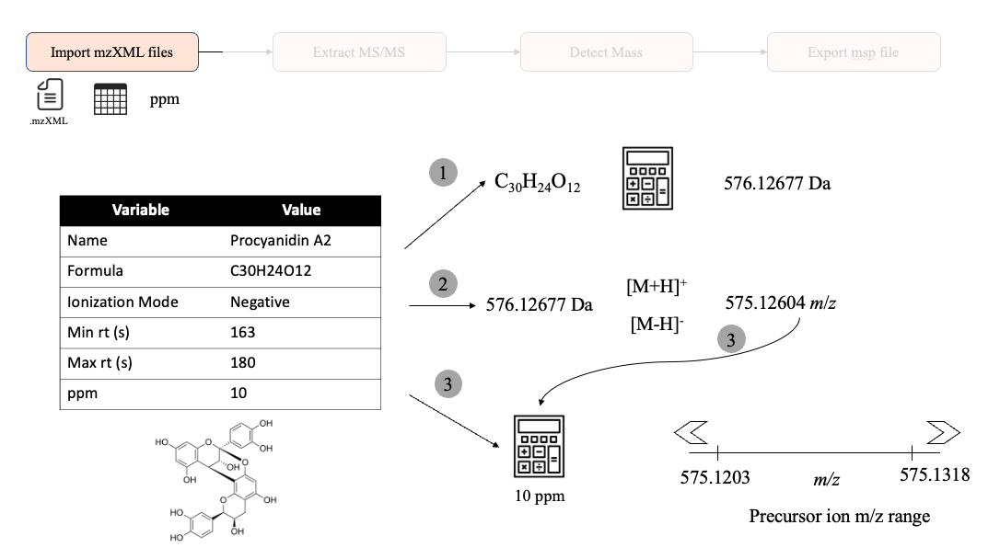
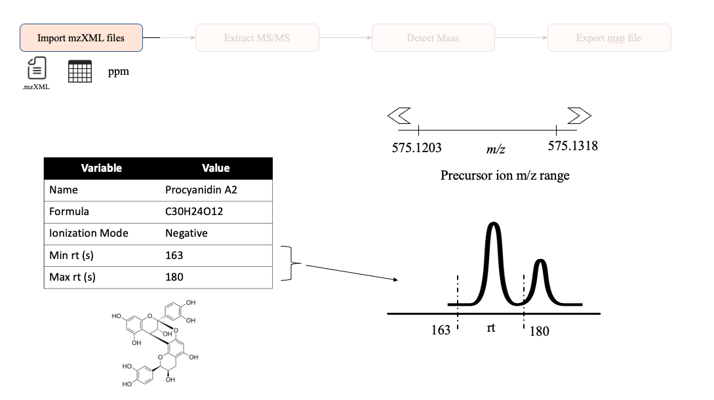
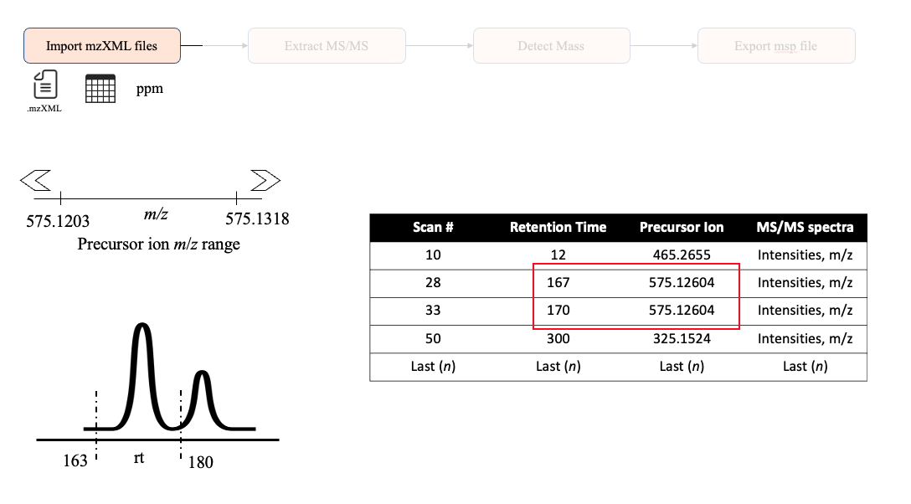

```{r setup, include = FALSE}
knitr::opts_chunk$set(
    collapse = TRUE,
    comment = "#>",
    crop = NULL ## Related to https://stat.ethz.ch/pipermail/bioc-devel/2020-April/016656.html
)
```

```{r vignetteSetup, echo=FALSE, message=FALSE, warning = FALSE}
## Track time spent on making the vignette
startTime <- Sys.time()

## Bib setup
library("RefManageR")

## Write bibliography information
bib <- c(
    R = citation(),
    BiocStyle = citation("BiocStyle")[1],
    knitr = citation("knitr")[1],
    RefManageR = citation("RefManageR")[1],
    rmarkdown = citation("rmarkdown")[1],
    sessioninfo = citation("sessioninfo")[1],
    testthat = citation("testthat")[1],
    MS2extract = citation("MS2extract")[1]
)
library(MS2extract)
```

# Goal of this vignette

The main objective of this document is to explain in a detailed manner
how we import and process MS/MS when you use `import_mzxml()`.

This document is organized based on the main steps we take to import
MS/MS data:

-   Calculating the theoretical precursor ion,
-   Filtering MS/MS scans for a given precursor ion and rt range, and
-   Finding the most intense MS/MS scan.

# Calculating the theoretical precursor ion

One of the main inputs, besides the .mzML data, is the `met_metadata`
data frame used in `import_mzxml()`. This data frame contains the
minimum information to calculate the theoretical precursor ion *m/z*
given the following information:

-   Chemical formula,
-   Ionization polarity, and
-   ppm (mass error)

This process can be depicted in the following image.



Here, we are going to use procyanidin A2 to demonstrate this process.
(1) First, by using the `r Biocpkg("Rdisop")` package, we calculate the
theoretical monoisotopic mass. (2) Then, given an specific polarity
(*Positive* or *Negative*), we add or subtract the mass of a proton to
calculate the theoretical ionized *m/z* value. (3) Finally, we used the provided
ppm value (10 ppm by default) to calculate the *m/z* range that will be
used to filter scan that the precursor ion value falls within this
range.

You can also calculate this ppm range with `ppm_range()`

```{r}
ppm_range(mz = 575.12604, ppm = 10)
```

# Filtering MS/MS scans

## Using retention time region of interest

Although providing a retention time window is not mandatory, it is
highly suggested to provide this information to have more control over
the regions of the run that we look for the MS/MS scans. If you do not
provide a specific rt ROI, this package will look for the most intense
scan, even if those scans do not represent the desired scans from the provided
metabolite.



## Filtering using *m/z* range and rt ROI

Then, after calculating the theoretical *m/z* range, and knowing the rt
ROI, we can look in the data for the MS/MS scans that have this
information.

If `MS2extract` do not find at least one MS/MS scan within the given
*m/z* range and rt ROI, it will stop.

In the following example, the scan in the first row does not meet these
requirements, and it is discarded, while the second and third scan falls
within these requirements, and are kept for the next steps.



# Information about this vignette

Code for creating the vignette

```{r createVignette, eval=FALSE}
## Create the vignette
library("rmarkdown")
system.time(render("3_import_mzml_explanation.Rmd", "BiocStyle::html_document"))

## Extract the R code
library("knitr")
knit("3_import_mzml_explanation.Rmd", tangle = TRUE)
```

Date the vignette was generated.

```{r reproduce1, echo=FALSE}
## Date the vignette was generated
Sys.time()
```

Wallclock time spent generating the vignette.

```{r reproduce2, echo=FALSE}
## Processing time in seconds
totalTime <- diff(c(startTime, Sys.time()))
round(totalTime, digits = 3)
```

`R` session information.

```{r reproduce3, echo=FALSE}
## Session info
library("sessioninfo")
options(width = 120)
session_info()
```

# Bibliography

This vignette was generated using `r Biocpkg("BiocStyle")`
`r Citep(bib[["BiocStyle"]])` with `r CRANpkg("knitr")`
`r Citep(bib[["knitr"]])` and `r CRANpkg("rmarkdown")`
`r Citep(bib[["rmarkdown"]])` running behind the scenes.

Citations made with `r CRANpkg("RefManageR")`
`r Citep(bib[["RefManageR"]])`.

```{r vignetteBiblio, results = "asis", echo = FALSE, warning = FALSE, message = FALSE}
## Print bibliography
PrintBibliography(bib, .opts = list(hyperlink = "to.doc", style = "html"))
```
