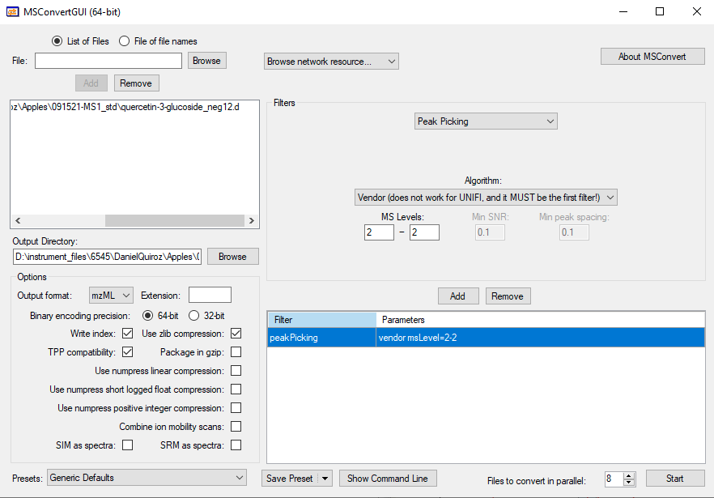
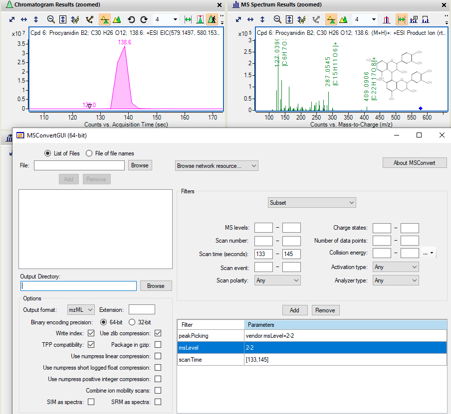

```{r setup, include = FALSE}
knitr::opts_chunk$set(
    collapse = TRUE,
    comment = "#>",
    crop = NULL ## Related to https://stat.ethz.ch/pipermail/bioc-devel/2020-April/016656.html
)
```

```{r vignetteSetup, echo=FALSE, message=FALSE, warning = FALSE}
## Track time spent on making the vignette
startTime <- Sys.time()

## Bib setup
library("RefManageR")

## Write bibliography information
bib <- c(
    R = citation(),
    BiocStyle = citation("BiocStyle")[1],
    knitr = citation("knitr")[1],
    RefManageR = citation("RefManageR")[1],
    rmarkdown = citation("rmarkdown")[1],
    sessioninfo = citation("sessioninfo")[1],
    testthat = citation("testthat")[1],
    MS2extract = citation("MS2extract")[1]
)
```

# Goal of this document

In this document, you will find more information describing multiple
scenarios about how to use
[MSconvert](https://link.springer.com/protocol/10.1007/978-1-4939-6747-6_23)
in order to transform your raw MS/MS data to .mzMl or mzXML format in
order to be imported with
[MS2extract](https://github.com/CooperstoneLab/MS2extract).

Here, we will explore different scenarios that you might find
useful depending on your MS/MS data collection approach. The explained
scenarios are:

-   Converting to `.mzML` the entire run, and
-   Trimming for specific retention time, 

*Note:* this is the fourth vignette for this package, and if you find some
terms unclear, or are not familiar with the concepts, please visit the
previous vignettes ([Package
introduction](https://cooperstonelab.github.io/MS2extract/articles/1_introduction.html),
[Batch mode
introduction](https://cooperstonelab.github.io/MS2extract/articles/2_using_batch_extract.html),
and [Importing MS/MS
data](https://cooperstonelab.github.io/MS2extract/articles/4_import_mzml_explanation.html)).

# Concept of MS2extract

Before moving to the hands-on application, we would like to clarify some
definitions about this software that could help improve the explanation
of the following case examples.

The [MS2extract](https://github.com/CooperstoneLab/MS2extract) concept
can be summarized in two main subsequent tasks; (1) look for scans with
a specific precursor ion *m/z*, and (2) extract the MS/MS fragmentation
pattern.

Therefore, your data file (*.mzML*) must contain at least one MS/MS scan
with the specified precursor ion to extract the MS/MS data.

# Case 1: Converting to .mzML the entire run

In this case, although it is not the optimal approach, it will get the job
done, if your data meets a requirement.

> Requirement 1: the precursor ion of your standard has to produce the
> most intense MS/MS signal in the entire run.

> Requirement 2: If you have compositional isomers in the same run, 
> but they elute at different retention times, you must provide different 
> retention times windows.

Since [MS2extract](https://github.com/CooperstoneLab/MS2extract)
searches for the most intense MS/MS scan, you can only have one
metabolite per run if you do not provide different retention time
windows.

Since this package only works with MS/MS data, we are only going to keep
scans with MS/MS data. Therefore, the MSconvert filters are:

| Filter      | Parameters         |
|-------------|--------------------|
| peakPicking | vendor msLevel=2-2 |
| msLevel     | 2-2                |



# Case 2: Trimming for specific retention time

This is probably the most efficient approach to convert your raw data
files, since you already know the retention time of your metabolite.
Then, you can use the scanTime filter. Remember, scan time has to be
converted to seconds, not minutes.

We used this approach to build the entire
[PhenolicsDB](https://github.com/CooperstoneLab/PhenolicsDB) repository,
where you can find the retention time window for each metabolite.

| Filter      | Parameters         |
|-------------|--------------------|
| peakPicking | vendor msLevel=2-2 |
| msLevel     | 2-2                |
| scanTime    | [min rt, max rt]   |

In the following example, we are using the procyanidin B2 standard data,
with an elution time of 138 (s), and minimum and maximum retention
time are 133 and 145 (s), respectively. Therefore, the MSconvert task
will look like the following image.



# Information about this vignette

Code for creating the vignette

```{r createVignette, eval=FALSE}
## Create the vignette
library("rmarkdown")
system.time(render("4_msconvert_4_MS2extract.Rmd", "BiocStyle::html_document"))

## Extract the R code
library("knitr")
knit("4_msconvert_4_MS2extract.Rmd", tangle = TRUE)
```

Date the vignette was generated.

```{r reproduce1, echo=FALSE}
## Date the vignette was generated
Sys.time()
```

Wallclock time spent generating the vignette.

```{r reproduce2, echo=FALSE}
## Processing time in seconds
totalTime <- diff(c(startTime, Sys.time()))
round(totalTime, digits = 3)
```

`R` session information.

```{r reproduce3, echo=FALSE}
## Session info
library("sessioninfo")
options(width = 120)
session_info()
```

# Bibliography

This vignette was generated using `r Biocpkg("BiocStyle")`
`r Citep(bib[["BiocStyle"]])` with `r CRANpkg("knitr")`
`r Citep(bib[["knitr"]])` and `r CRANpkg("rmarkdown")`
`r Citep(bib[["rmarkdown"]])` running behind the scenes.

Citations made with `r CRANpkg("RefManageR")`
`r Citep(bib[["RefManageR"]])`.

```{r vignetteBiblio, results = "asis", echo = FALSE, warning = FALSE, message = FALSE}
## Print bibliography
PrintBibliography(bib, .opts = list(hyperlink = "to.doc", style = "html"))
```
