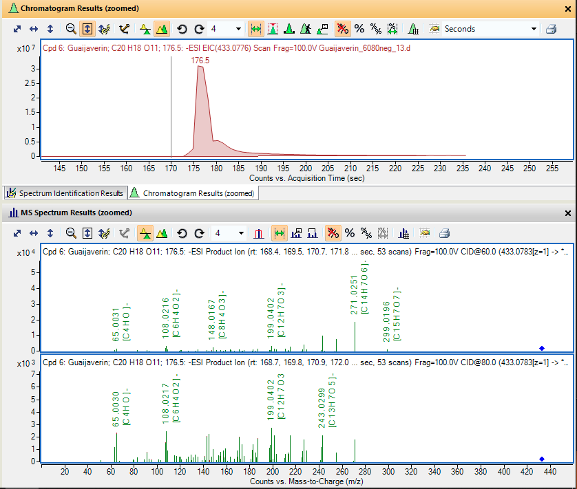

```{r setup, include = FALSE}
knitr::opts_chunk$set(
    collapse = TRUE,
    comment = "#>",
    crop = NULL ## Related to https://stat.ethz.ch/pipermail/bioc-devel/2020-April/016656.html
)
```

```{r vignetteSetup, echo=FALSE, message=FALSE, warning = FALSE}
## Track time spent on making the vignette
startTime <- Sys.time()

## Bib setup
library("RefManageR")

## Write bibliography information
bib <- c(
    R = citation(),
    BiocStyle = citation("BiocStyle")[1],
    knitr = citation("knitr")[1],
    RefManageR = citation("RefManageR")[1],
    rmarkdown = citation("rmarkdown")[1],
    sessioninfo = citation("sessioninfo")[1],
    testthat = citation("testthat")[1],
    MS2extract = citation("MS2extract")[1]
)
```

# Goal of this document

In this document, you will find more information describing multiple
scenarios about how to use
[MSconvert](https://link.springer.com/protocol/10.1007/978-1-4939-6747-6_23)
in order to transform your raw MS/MS data to .mzMl or mzXML format in
order to be imported with
[MS2extract](https://github.com/CooperstoneLab/MS2extract).

Here, we will explore *N* different scenarios that you might might find
useful depending on your MS/MS collection approach. The explained
scenarios are:

-   Converting the entire run,
-   Trimming for specific retention time, and
-   Extracting MS/MS scans of multiples CE from the same run

This is a third vignette for this package and if you find some terms
unclear, or are not familiar with the concepts, please visit the
previous vignettes ([Package
introduction](https://cooperstonelab.github.io/MS2extract/articles/introduction.html),
[Batch
mode](https://cooperstonelab.github.io/MS2extract/articles/using_batch_extract.html)).

# Concept of MS2extract

Before moving to the hands-on application, we would like to clarify some
definitions about this software that could help improve the explanation
of the following case examples.

The [MS2extract](https://github.com/CooperstoneLab/MS2extract) concept
can be summarized in two main subsequent tasks; (1) Look for scans with
a specific precursor ion *m/z*, and (2) extract the MS/MS fragmentation
pattern.

Therefore, your data file (*.mzML*) must contain at least one MS/MS scan
with the specified precursor ion to extract the MS/MS data.

# Case 1: Converting the entire run

In this case, although is not the optimal approach, it will get the job
done, if your data meets a requirement.

> Requirement: the precursor ion of your standard has to produce the
> most intense signal in the entire run.

> Requirement: If you have isomers in the same run, but they elute at
> different retention times, you must provide different retention times
> windows.

Since [MS2extract](https://github.com/CooperstoneLab/MS2extract)
searches for the most intense MS/MS scan, you can only have one
metabolite per run if you do not provide different retention time
windows.

Since this package only works with MS/MS data, we are going only to keep
MS/MS scans. Therefore, the MSconvert filters are:

| Filter      | Parameters         |
|-------------|--------------------|
| peakPicking | vendor msLevel=2-2 |
| msLevel     | 2-2                |


# Case 2: Trimming for specific retention time

This is probably the most efficient approach to convert your raw data
files, since you already know the retention time of your metabolite.
Then, you can use the scanTime filter. Remember, scan time has to be
converted to seconds, not minutes.

| Filter      | Parameters         |
|-------------|--------------------|
| peakPicking | vendor msLevel=2-2 |
| msLevel     | 2-2                |
| scanTime    | [min rt, max rt]   |

In the following example, we are converting the procyanidin B2 standard,
with a elution time of 138 (s), and the minimum and maximum retention
time are 133 and 145 (s), respectively. Therefore, the MSconvert task
will look like the following image.


# Case 3: Multiple CE in the same run

Unfortunately, the current version of
[MS2extract](https://github.com/CooperstoneLab/MS2extract) does not
support importing MS/MS files with different CE in the same run. Then,
user will need to separate CE described in this section.

For this example, we are going to use guaijaverin (quercetin
3-arabinopyranoside), to exemplify this case. In the following image,
you can see the EIC of the metabolite in negative polarity. Then, the
first MS/MS spectra refers to the fragmentation pattern at 60 eV, while
the second MS/MS spectra refers to 80 eV.



Now, in order to separate scans in MSconvert, we need to specify one CE
at a time. Here, you can see that we are using the \*Collision energy\*
filter to subset MS/MS scans with a CE of 60 eV. Then, the filters for
this metabolite will be:

| Filter          | Parameters         |
|-----------------|--------------------|
| peakPicking     | vendor msLevel=2-2 |
| msLevel         | 2-2                |
| scanTime        | [min rt, max rt]   |
| collisionEnergy | low=60 high=60     |


Once you convert this file, now you can change the collision energy to a
different value and convert the raw data for the rest of CE availables.
The same principle can be applied for MS/MS data with multiple
polarities in the same run.

> Note: remember to change the .mzml file name as it will overwrite the
> file with the new CE value.

# Information about this vignette

Code for creating the vignette

```{r createVignette, eval=FALSE}
## Create the vignette
library("rmarkdown")
system.time(render("msconvert_4_MS2extract.Rmd", "BiocStyle::html_document"))

## Extract the R code
library("knitr")
knit("msconvert_4_MS2extract.Rmd", tangle = TRUE)
```

Date the vignette was generated.

```{r reproduce1, echo=FALSE}
## Date the vignette was generated
Sys.time()
```

Wallclock time spent generating the vignette.

```{r reproduce2, echo=FALSE}
## Processing time in seconds
totalTime <- diff(c(startTime, Sys.time()))
round(totalTime, digits = 3)
```

`R` session information.

```{r reproduce3, echo=FALSE}
## Session info
library("sessioninfo")
options(width = 120)
session_info()
```

# Bibliography

This vignette was generated using `r Biocpkg("BiocStyle")`
`r Citep(bib[["BiocStyle"]])` with `r CRANpkg("knitr")`
`r Citep(bib[["knitr"]])` and `r CRANpkg("rmarkdown")`
`r Citep(bib[["rmarkdown"]])` running behind the scenes.

Citations made with `r CRANpkg("RefManageR")`
`r Citep(bib[["RefManageR"]])`.

```{r vignetteBiblio, results = "asis", echo = FALSE, warning = FALSE, message = FALSE}
## Print bibliography
PrintBibliography(bib, .opts = list(hyperlink = "to.doc", style = "html"))
```
